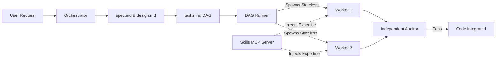
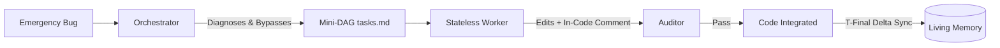

# dag-flow


[](#the-proof-benchmarks)

An advanced Software-Defined Development (SDD) architecture for autonomous AI agents that strictly separates cognitive planning from motor execution. 

Eliminates "Monolithic Dumping" and context window exhaustion, enabling scalable codebase generation with **mathematically verified, atomic task graphs**.

---

## The Problem

Traditional conversational AI agents and linear Multi-Agent Systems fail predictably on complex projects due to three systemic flaws:

1. **Monolithic Dumping:** The agent tries to satisfy all constraints in a single prompt, spitting out tightly coupled, 200-line "spaghetti code" files.
2. **Context Exhaustion:** Workers return verbose error logs directly to the main orchestrator, filling its memory with operational noise and inducing "cognitive laziness" (ignoring architectural rules).
3. **Test Bias:** If the same neural network context writes the bug and the test, the test will pass the bug.

## How dag-flow Solves It

`dag-flow` implements a neurocognitive paradigm: the **Orchestrator** (Prefrontal Cortex) handles logic and design but is physically forbidden from writing code. The manual labor is delegated to stateless, amnesic **Workers** (Motor System).



By decoupling the Orchestrator from execution, features are broken into a Directed Acyclic Graph (DAG) of atomic steps. Each step is built in total isolation. **Crucially, workers are not generic**: before executing, they query the local **Skills MCP Server** to dynamically inject the exact expertise required for their specific atomic task, and nothing else. Finally, their work is verified by an independent LLM-as-a-judge auditor.

### Quick Mode (Emergency Hotfixes)
For emergency bug fixes, the heavy Socratic interrogation and architectural design ceremonies are bypassed to deliver raw speed while retaining execution safety.



## The Proof: Benchmarks

We ran a strict End-to-End Evaluation comparing a top-tier Baseline Agent against the Orchestrated `dag-flow` Agent to build a complete RBAC (Role-Based Access Control) API in Node.js.

| Metric | Baseline Agent | dag-flow |
|:---|:---|:---|
| **Architecture** | 1 Monolithic File (~150 lines) | 4 Isolated Modules (`db`, `middleware`, `app`, `test`) |
| **Test Bias** | High (Same context wrote tests & code) | Eliminated (Blind worker wrote tests) |
| **Scalability** | 0/10 (Guaranteed hallucination at scale) | 10/10 (Modular, DAG-driven execution) |

[👉 Read the full RBAC Benchmark Study and view the raw outputs](docs/benchmarks.md)

---

## Quick Start

### 1. Prerequisites
You need Node.js (v22+), your preferred AI Agent CLI, and the mandatory token-economy infrastructure tools:
```bash
npm install -g context-mode
cargo install rtk-ai
```

### 2. Setup the Project
```bash
git clone https://github.com/guilhermejorgee/dag-flow.git
cd dag-flow

# Build the bundled skills server
cd mcp && npm install && npm run build && cd ..
```

### 3. Wire Your Agent
Run the indexing hook setup script for your specific runtime (e.g., `antigravity`, `claude`, `cursor`, `gemini-cli`):
```bash
./hooks/setup_indexer.sh --runtime claude
```

### 4. Run Your First Feature
1. **Specify:** Ask your agent: *"Specify a new feature: a user login system."* Answer its questions.
2. **Execute:** Once it generates the `tasks.md` DAG, run the automated executor:
```bash
./scripts/run_dag.sh .specs/features/user-login/tasks.md
```

[Read the full Getting Started Guide →](docs/getting-started.md)

---

## The 6 Phases of dag-flow

| Phase | Description | Key Output |
|:---|:---|:---|
| **A. Map** | **Living Memory Initialization:** Discovers the repo structure without expensive raw code scans, seeding the `context-mode` vector index. | `agentmemory` invariants |
| **B. Specify** | Socratic interrogation to eradicate ambiguity. | `spec.md`, `CONTEXT.md` |
| **C. Design** | Technical architecture and trade-off decisions. | `design.md`, `ADRs` |
| **D. Tasks** | Converts specs/design into an executable graph. Includes **T-Final** to update the Living Memory. | `tasks.md` (The DAG) |
| **E. Execute** | Decentralized Bash execution of stateless workers, powered by **Dynamic Skill Injection (MCP)**. | Application Source Code |
| **F. Quick Mode** | **The Emergency Flow:** Bypasses heavy Spec/Design ceremony for rapid hotfixes. Diagnoses the bug and generates a streamlined Mini-DAG. | Mini-DAG |

---

## Core Toolchain

`dag-flow` operates encapsulated within a rigorous suite of tools designed to shield the LLM's context window. These dependencies are mandatory for the execution motor.

| Tool | Role | Function |
|:---|:---|:---|
| `rtk-ai` | **Token Killer** | Transparent CLI proxy that compresses terminal output (tests, logs) before it reaches the model. |
| `context-mode` | **Living Memory** | MCP layer that forces the agent to "Think in Code", preventing mass codebase reads. Powers the T-Final delta updates. |
| `agentmemory` | **State** | Persistent retrieval system that works with `context-mode` to maintain an evolving, indexed map of the architecture. |

---

## Documentation

- [Getting Started](docs/getting-started.md) — Full installation and first-run guide.
- [Architecture](docs/architecture.md) — Technical deep-dive into the Orchestrator, Workers, and Memory.
- [Theory & Research](docs/theory.md) — The neurocognitive paradigm and language alignment theory behind the project.
- [Benchmarks](docs/benchmarks.md) — End-to-End evaluations and proof of concept.
- [Examples](docs/examples.md) — Practical timelines of feature creation and hotfixing.

## Contributing

We welcome contributions that adhere to the systemic principles of cognitive separation. Please read our [Contributing Guidelines](CONTRIBUTING.md) before submitting a Pull Request.

## Research
This project is backed by extensive systemic and architectural research. The original research papers (in Portuguese) are preserved in the [`research/`](research/README.md) directory.

## Author

**Guilherme Jorge**
- [GitHub](https://github.com/guilhermejorgee)
- [LinkedIn](https://www.linkedin.com/in/guilhermejorgee)

## License

[MIT License](LICENSE)
