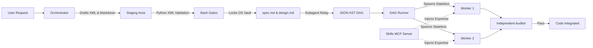
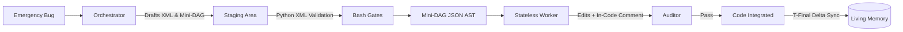

# dag-flow


[](#the-proof-benchmarks)

An advanced Software-Defined Development (SDD) architecture for autonomous AI agents that strictly separates cognitive planning from motor execution. 

**The End of the Monolith.** By enforcing physical vaulting and stateless execution, `dag-flow` mathematically eliminates the twin demons of agentic coding: **LLM Overconfidence** and **Few-Shot Ossification**. It enables scalable codebase generation with mathematically verified, atomic task graphs.

👉 **[Read the dag-flow Manifesto](docs/manifesto.md)**

---

## The Problem

Traditional conversational AI agents and linear Multi-Agent Systems fail predictably on complex projects due to three systemic flaws:

1. **Monolithic Dumping:** The agent tries to satisfy all constraints in a single prompt, spitting out tightly coupled, 200-line "spaghetti code" files.
2. **Context Exhaustion:** Workers return verbose error logs directly to the main orchestrator, filling its memory with operational noise and inducing "cognitive laziness" (ignoring architectural rules).
3. **Test Bias:** If the same neural network context writes the bug and the test, the test will pass the bug.

## How dag-flow Solves It

`dag-flow` implements a neurocognitive paradigm: the **Orchestrator** (Prefrontal Cortex) handles logic and design but is physically forbidden from writing code. The manual labor is delegated to stateless, amnesic **Workers** (Motor System).



By decoupling the Orchestrator from execution, features are broken into a Directed Acyclic Graph (DAG) of atomic steps. Each step is built in total isolation. **Crucially, workers are not generic**: before executing, they query the local **Skills MCP Server** to dynamically inject the exact expertise required for their specific atomic task, and nothing else. Finally, their work is verified by an independent LLM-as-a-judge auditor.

### Topology Separation & OS-Level Gating
To combat "Semantic Gravity" and LLM overconfidence where models ignore prompt-based constraints and hallucinate DAG formats, `dag-flow` uses **physical OS-level boundaries**. Human-readable specs live in `.specs/features/`, while executable DAGs live in `.specs/dags/`. **Both of these directories are physically locked** (`chmod 555`).

The Orchestrator cannot write to these vaults directly. It must draft its cognitive trace (PAGRL XML) and Markdown artifacts into an open `.specs/staging/` area. Then, it uses deterministic **Bash Gates** (`commit_spec.sh`, `commit_design.sh`, `write_dag.sh`) which run raw Python string-slicing to validate the XML format, bypassing LLM markdown hallucinations, before safely moving the files to the vaults and restoring the lock. To further isolate the lock, the actual JSON DAG generation is handed off to a read-only **Subagent Planner**.

### Quick Mode (Emergency Hotfixes)
For emergency bug fixes, the heavy Socratic interrogation and architectural design ceremonies are bypassed to deliver raw speed while retaining execution safety.



## The Proof: 100% E2E Benchmark Success

To prove that `dag-flow` systematically defeats ossification, we developed a comprehensive, fully-automated E2E Harness (`e2e-v0.1.0`) simulating extreme real-world conditions (Brownfield Discovery, Skill Injection, Ambiguous Specs, and Emergency Hotfixes).

In our latest benchmark, the `dag-flow` Orchestrator achieved a **100% Pass Rate** across all 6 scenarios, while baseline models collapsed into monolithic dumps and hallucination loops.

| Scenario | Focus | Score | Result |
|:---|:---|:---|:---|
| **S1-S6 Suite** | End-to-End Autonomous Orchestration | 100% | 🟢 PASS |
| **Architecture** | Component Domain Isolation | 10/10 | 🟢 PASS |
| **Anti-Ossification**| Stateless Recovery from Errors | 10/10 | 🟢 PASS |

[👉 Read the full Benchmark Study, including the Qualitative RBAC Showdown](docs/benchmarks/index.md)

---

## Quick Start

### 1. Prerequisites
You need Node.js (v22+), your preferred AI Agent CLI, and the mandatory token-economy infrastructure tools:
```bash
npm install -g context-mode
cargo install rtk-ai
```

### 2. Setup the Project
```bash
git clone https://github.com/guilhermejorgee/dag-flow.git
cd dag-flow

# Build the bundled skills MCP (local — not on npm registry)
cd mcp && npm install && npm run build && npm link && cd ..
```

See [local install (`npm link`)](docs/planning/multi-runtime-implementation-plan.md#q3--instalação-local-npm-link) for MCP wiring details.

### 3. Wire Your Agent

**Skills MCP:** Point your agent runtime at the absolute path to `mcp/main.js` (or use the `agent-skills-mcp` bin after `npm link`). See [mcp/README.md](mcp/README.md).

**dag-flow skill:** Copy this repository into your orchestrator's skills directory (e.g. `.agents/skills/dag-flow/`) until `dag init` ships — track [multi-runtime implementation plan](docs/planning/multi-runtime-implementation-plan.md).

**Project topology:** Create `.specs/staging/` (`chmod 755`), `.specs/features/` and `.specs/dags/` (`chmod 555`), or use `dag init` when available.

**Indexing:** Install `context-mode` separately (prerequisite above). It is not configured by dag-flow install.

> **Removed:** `hooks/setup_indexer.sh` mixed dag-flow bootstrap with context-mode setup. Use `dag init` for project scaffold; install `context-mode` separately.

### 4. Run Your First Feature
1. **Specify:** Ask your agent: *"Specify a new feature: a user login system."* Answer its questions.
2. **Execute:** Once it generates the executable JSON DAG, run the automated executor:
```bash
./scripts/run_dag.sh .specs/dags/user-login.json
```

[Read the full Getting Started Guide →](docs/getting-started.md)

---

## The Core Feature Pipeline

| Phase | Description | Key Output |
|:---|:---|:---|
| **1. Specify (The Eradicator)** | Socratic interrogation divided into two physical phases (Surface & Steer). Generates `common_ground.md`, forces a human approval turn break, and drafts `spec.md` and `CONTEXT.md` in `.specs/staging/`. | `common_ground.md`, `spec.md`, `CONTEXT.md` |
| **2. Design** | Technical architecture and trade-off decisions. Drafted in `.specs/staging/`. | `design.md`, `ADRs` |
| **3. Tasks** | A read-only **Subagent Planner** converts specs/design into an executable graph. Validated via `write_dag.sh` OS-level gate. Includes **T-Final** to update the Living Memory. | `.specs/dags/*.json` (The DAG) |
| **4. Execute** | Decentralized concurrent Python execution of stateless workers, powered by **Dynamic Skill Injection (MCP)**. | Application Source Code |

## Standalone Operations

| Operation | Description | Key Output |
|:---|:---|:---|
| **Discovery** | **Project Mapping:** Discovers the repo structure to learn architectural invariants. Manual initialization for brownfield projects. | `CONTEXT.md` invariants |
| **Quick Mode** | **The Emergency Flow:** Bypasses heavy Spec/Design ceremony for rapid hotfixes. Diagnoses the bug and generates a streamlined Mini-DAG. | Mini-DAG |

---

## Core Toolchain

`dag-flow` operates encapsulated within a rigorous suite of tools designed to shield the LLM's context window. These dependencies are mandatory for the execution motor.

| Tool | Role | Function |
|:---|:---|:---|
| `rtk-ai` | **Token Killer** | Transparent CLI proxy that compresses terminal output (tests, logs) before it reaches the model. |
| `context-mode` | **Living Memory** | MCP layer that forces the agent to "Think in Code", preventing mass codebase reads. Powers the T-Final delta updates. |

---

## Documentation

- **[The Manifesto](docs/manifesto.md) — Why we must kill the Monolith.**
- [Getting Started](docs/getting-started.md) — Full installation and first-run guide.
- [Architecture](docs/architecture/architecture.md) — Technical deep-dive into the Orchestrator, Workers, and Memory.
- [Theory & Paradigm](docs/theory.md) — The psychological mechanics that make it work.
- [Benchmarks](docs/benchmarks/index.md) — End-to-End evaluations (100% Pass Rate).
- [Examples](docs/examples.md) — Practical timelines of feature creation and hotfixing.

## Contributing

We welcome contributions that adhere to the systemic principles of cognitive separation. Please read our [Contributing Guidelines](CONTRIBUTING.md) before submitting a Pull Request.

## Research
This project is backed by extensive systemic and architectural research. The original research papers (in Portuguese) are preserved in the [`docs/design/`](docs/design/) directory.

## Author

**Guilherme Jorge**
- [GitHub](https://github.com/guilhermejorgee)
- [LinkedIn](https://www.linkedin.com/in/guilhermejorgee)

## License

[MIT License](LICENSE)
