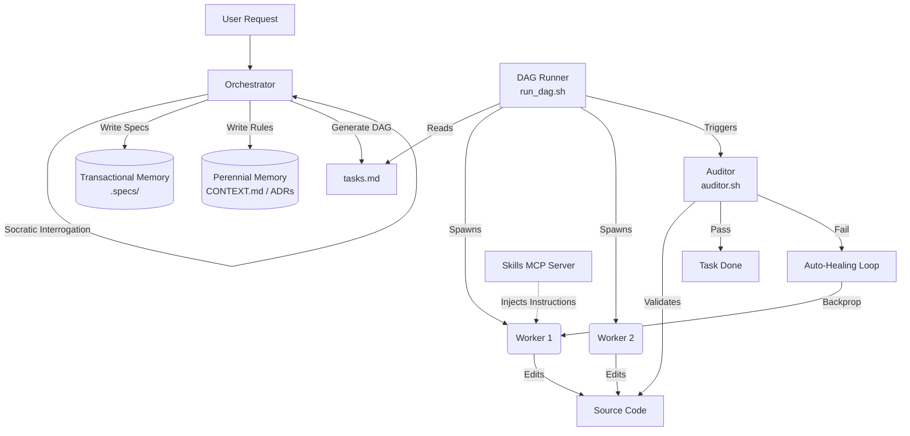

# dag-flow Architecture

To eliminate the systemic failures of conversational AI code generation (Monolithic Dumping, Context Exhaustion, Test Bias), `dag-flow` implements a strict structural architecture dividing the system into **Governance** and **Execution**.

---

## 1. System Components

### The Orchestrator
The executive controller. It does **not** write application code. Its role is purely analytical:
- It interrogates the user to eradicate ambiguity.
- It designs the architecture and documents decisions.
- It generates the execution DAG (`tasks.md`).
- It is shielded from raw execution logs to protect its context window.

### The Stateless Workers
The motor system. Spawned by the DAG Runner via CLI.
- They are completely "dumb" and amnesic. They don't know the full architecture; they only know their specific task and the files they are allowed to touch.
- This creates the **Financial Firewall**: executing complex features is exponentially cheaper because workers only load the exact tokens they need for their atomic task.

### The DAG Runner (`run_dag.sh`)
The automated Bash script that parses the `tasks.md` table.
- Dispatches workers in parallel based on task dependencies.
- Handles the Auto-Healing Loop (feeding errors back to the worker).
- Runs the Auditor for verification.

### The Independent Auditor (`auditor.sh`)
The gatekeeper. It executes the `Done When` command defined in the DAG table.
- **Mechanical Tasks:** Runs standard test commands (e.g., `npm test`).
- **Architectural Tasks:** Uses a Zero-Context LLM judge to verify if the code adheres to the systemic rules, without reading the full specification.

### Dynamic Skill Injection (`dag-flow-skills` MCP Server)
A core innovation of `dag-flow` is **dynamic specialization**. Stateless workers are deliberately "dumb" by default to save tokens. However, the Orchestrator identifies the specific technical domains required for each atomic task.

When the DAG Runner dispatches a worker, the worker first queries the local **Skills MCP Server**. If the task involves modifying a Chrome Extension, the worker injects the `chrome-extensions` skill. If it involves complex modern CSS, it injects `modern-web-guidance`. 
This guarantees that the worker has Senior-level expertise *exactly tailored to its specific challenge*, without bloating the Orchestrator's context window.

---

## 2. The Operational Phases

The architecture flows through 6 distinct phases:

1. **Map (The Cartographer):** Populates the system's memory with the existing codebase structure (for brownfield projects) before specification begins.
2. **Specify (The Eradicator):** Deep Socratic interrogation. Generates the `spec.md` and updates the ubiquitous language dictionary (`CONTEXT.md`).
3. **Design (The Architect):** Identifies trade-offs, defines infrastructure, and generates Architecture Decision Records (`docs/adr/`).
4. **Tasks (The Engineer):** Converts the Spec and Design into the executable Directed Acyclic Graph (`tasks.md`).
5. **Implement (The Factory Floor):** The manual execution phase where `run_dag.sh` takes over and coordinates the Workers and Auditor.
6. **Quick Mode (The Diagnostic):** A streamlined diagnostic phase for emergency hotfixes, bypassing the heavy Spec/Design ceremony to generate a Mini-DAG.

---

## 3. The Memory Architecture

`dag-flow` treats memory as files on disk rather than ephemeral LLM chat history. Memory is strictly divided into two categories:

### ⏳ Transactional Memory (The Action)
Stored in `.specs/features/*/`. Includes `spec.md`, `design.md`, and `tasks.md`.
These are operational drafts. Once the DAG Runner completes the feature, these artifacts lose their active utility. The system deliberately ignores them in future interactions to prevent context exhaustion.

### 💎 Perennial Memory (The Law)
Stored at the root (`CONTEXT.md`) and in `docs/adr/`.
This is the system's eternal jurisprudence. 
- `CONTEXT.md` explicitly defines the domain language and forbids synonyms.
- `ADRs` record why architectural choices were made.
These files survive forever. The Orchestrator references them in all future sessions to ensure new features don't violate past rules.

---

## 4. Living Memory (The Delta Update Synergy)

A common flaw in agentic coding is the need to constantly re-scan the entire codebase to understand the current state. This burns massive amounts of tokens and degrades the LLM's reasoning due to context window saturation.

`dag-flow` solves this via the **Living Memory ecosystem**, powered by `context-mode` and `agentmemory`:

1. **The Map Phase (Initialization):** When `dag-flow` encounters a new repository, it doesn't read every file. It uses `context-mode` to surgically index the structural invariants, creating a highly compressed vector map of the architecture in `agentmemory`.
2. **The T-Final Task (Delta Update):** When the Orchestrator generates the DAG (`tasks.md`), it injects a final task at the end (`T-Final`). Because the Orchestrator just planned the feature, it knows *exactly* which files will be modified by the workers. 
3. **The Silent Sync:** Once the workers finish, the `T-Final` task instructs the indexer to update *only* those specific modified files. 

The system memory stays perfectly synchronized with the architecture in real-time, achieving an evolving, living memory with near-zero token waste.

---

## 5. Quick Mode (The Emergency Flow)

While the full Governance loop (Map -> Specify -> Design -> Tasks) provides mathematical certainty, it is too heavy for emergency hotfixes. 

**Quick Mode** is a dedicated architectural pathway designed for rapid response:
- **Diagnostic Bypass:** It completely bypasses the Specification and Design ceremonies.
- **The Mini-DAG:** The Orchestrator diagnoses the bug directly and generates a streamlined `tasks.md` containing only the immediate fix and the Auditor test.
- **In-Code Accountability:** Because there is no formal `spec.md` generated, Quick Mode workers are subject to a strict rule: they *must* leave a mandatory in-code comment explaining the rationale of the hotfix.

This ensures that even when the system moves fast, it never compromises architectural traceability.
